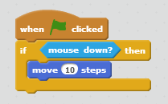

# scratching

### scratching allows you to write Scratch programs in Processing.

written by Buck Bailey and Eli Baum, 2014


By now, you are probably an expert in Scratch. But most programming languages are not like Scratch. Instead of dragging in blocks, you type commands.

So instead of



you would write something like

```
function whenGreenFlagClicked() {
    if (mouseDown == true) {
        move(10)
    }
}
```

Just like there are many spoken languages (English, Spanish, Chinese) there are also many programming languages. You have been working in **Scratch**. You may have heard of others. Now, you will learn **Processing**, which is based on **Java**.

We have written some code (called "**scratching**") which will allow to you write Processing programs from your old Scratch programs. All you need to do is copy scratching into a new tab in Processing.

Below are some instructions on how to use Processing, as well as a full reference for all of the scratching commands.

---

##### Let's take a look at a basic sketch:

Explanation of all code is below.

```
Sprite cat;

void setup() {
	size(600, 600);
	cat = new Sprite(this);
}

void draw() {
	background(0);
	
	cat.move(2);
	cat.update();
}
```

If you run it, you should see the cat moving to the right across the screen.

So how does it work?

`Sprite cat;` This makes a sprite called "cat". **Notice the semicolon ; at the end of the line. You need one after every command!**

`void setup() {` The setup function runs once, at the beginning of your program. This is its *function definition*. A function is like a script in Scratch. It must have a name ("setup"), followed by parantheses. The curly bracket starts the function. Inside of functions, we usually *indent* code (use the tab key).

*What does "void" mean?* I'll tell you later.[^1]

`size(600,600);` The size *function* tells the computer how big you want your window to be. Here, it is 600 pixels by 600 pixels. Notice the semicolon at the end of the line!

`cat = new Sprite(this);` This line actually *creates* the *new* sprite. Don't worry to much about it for now. Just don't forget it.

You know what else you shouldn't forget? ***Semicolons!***

*What does "this" mean?* Stop asking so many questions.[^2]

`}` This curly bracket closes the setup function.

Next, we have the `draw` function. The draw functions runs over and over again. So you can use to repeatedly draw to or update the window. Because of this, if you only want to draw something once (something that never needs to be updated), you can just put it in `setup`.

`background(0);` You'll probably always want this line at the beginning of your draw function. It clears the screnn: the argument is a color. 0 is black, 255 is white, everything in between is gray.

If you didn't clear the background, you would just keep seeing new images of the cat sprite on top of eachother.

`cat.move(2);` As you can probably guess, this command **moves** the **cat** sprite **2** pixels. Note that because the draw functions loops over and over again, the cat repeatedly moves 2 pixels — the result is that you see smooth motion on your screen.

`cat.update();` This actually draws the cat to the screen.

[^1]: The first word of a function — in this case, `void`, tells you what the function returns. The setup function (along with many other functions) returns nothing; in programming parlance this datatype is called `void`.

[^2]: `this` just tells Processing to create the Sprite in the current application... an unfortunate complication.
